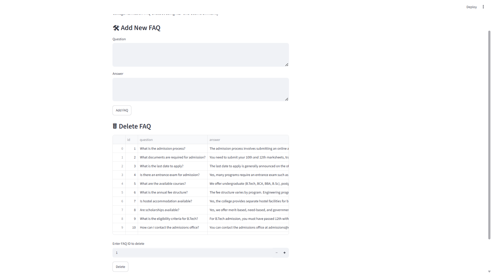
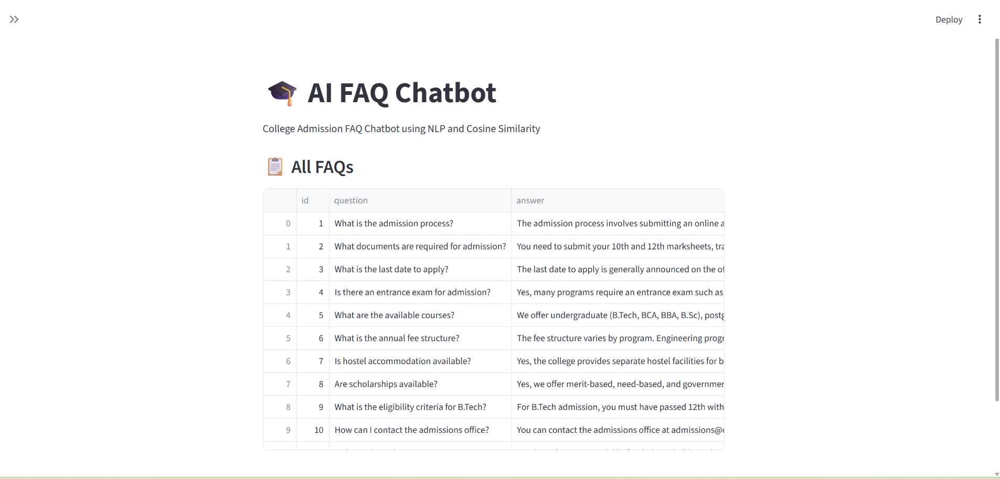

# 🎓 AI FAQ Chatbot using NLP

An AI-powered FAQ Chatbot built using **Python, Streamlit, SQLite, Scikit-learn, TF-IDF, and Cosine Similarity**. The chatbot helps users find answers to frequently asked college admission questions using Natural Language Processing (NLP) techniques.

---

## 📌 Project Overview

This project is designed to answer college admission-related queries intelligently. Users can ask questions in natural language, and the chatbot finds the most relevant answer from stored FAQs using NLP techniques.

The chatbot uses:

* TF-IDF (Term Frequency-Inverse Document Frequency)
* Cosine Similarity
* SQLite Database
* Streamlit User Interface

The project also includes an Admin Panel where FAQs can be added, viewed, and deleted dynamically.

---

## ✨ Features

* 💬 Interactive Chatbot Interface
* 🧠 NLP-based Question Matching
* 🔍 TF-IDF Vectorization
* 📊 Cosine Similarity Matching
* 🗄️ SQLite Database Integration
* 🛠️ Admin Panel for FAQ Management
* ➕ Add New FAQs
* 🗑️ Delete Existing FAQs
* 📋 View All FAQs
* 📈 Confidence Score Display
* ⚠️ Fallback Response for Low Confidence Queries
* 🎨 Simple and Clean Streamlit UI

---

## 🧱 Tech Stack

| Technology   | Purpose                    |
| ------------ | -------------------------- |
| Python       | Programming Language       |
| Streamlit    | User Interface             |
| SQLite       | Database                   |
| Pandas       | Data Handling              |
| Scikit-learn | TF-IDF & Cosine Similarity |
| NLP          | Text Processing            |

---

## 📁 Project Structure

```text
ai_faq_chatbot/
│
├── app.py
├── requirements.txt
├── README.md
├── faq_chatbot.db
├── screenshots/
│   ├── chatbot.png
│   ├── admin-panel.png
│   └── faq-list.png
│
└── .gitignore
```

---

## ⚙️ Installation

### Clone Repository

```bash
git clone https://github.com/YOUR_USERNAME/ai-faq-chatbot.git
cd ai-faq-chatbot
```

### Create Virtual Environment

```bash
python -m venv venv
```

### Activate Environment

Windows:

```bash
venv\Scripts\activate
```

### Install Dependencies

```bash
pip install -r requirements.txt
```

---

## 🚀 Run the Project

```bash
streamlit run app.py
```

Open browser:

```text
http://localhost:8501
```

---

## 💡 How It Works

### Step 1

User enters a question.

### Step 2

Question is preprocessed and converted into numerical vectors using TF-IDF.

### Step 3

Cosine Similarity compares the user's question with all stored FAQ questions.

### Step 4

The most similar FAQ is selected.

### Step 5

The corresponding answer is displayed.

### Step 6

If the confidence score is too low, a fallback response is shown.

---

📸 Screenshots
Chatbot Interface


Admin Panel



FAQ Database View


## 🎯 Future Improvements

* Chat History Feature
* FAQ CSV Upload
* FAQ Categories
* Better Text Preprocessing
* Semantic Search using Sentence Transformers
* Analytics Dashboard
* Multilingual Support
* Voice Assistant

---

## 📄 License

This project is open-source and available for educational purposes.

---

## 👨‍💻 Author

**Amit Pandey**

B.Tech CSE (AI)

Noida Institute of Engineering and Technology (NIET)

GitHub: https://github.com/Amit27181

LinkedIn:www.linkedin.com/in/amitpandey12
